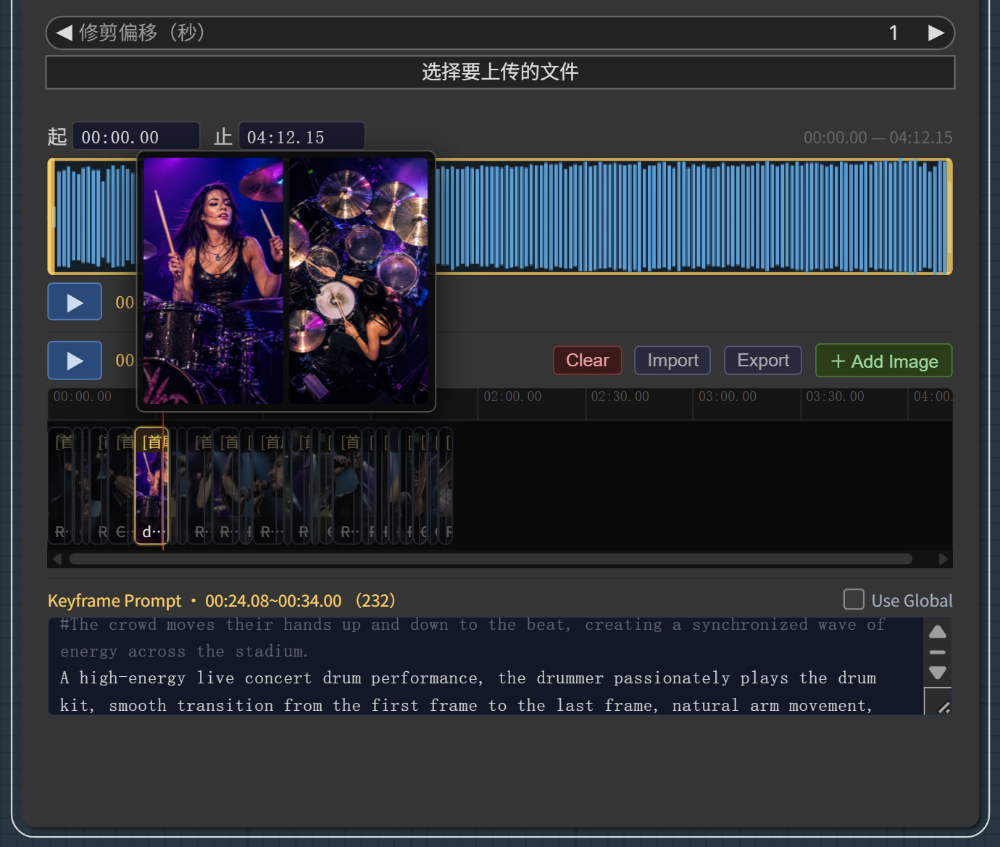

# ComfyUI-Capricorncd-Tools


一套面向 [ComfyUI](https://github.com/comfyanonymous/ComfyUI) 的自定义节点集合，专注于提示词编辑、音频/图像关键帧时间轴编辑与视频合成。



---

## 节点一览

| 节点 | 说明 | 文档 |
|------|------|------|
| **Prompt Input** | 支持 `#` 行注释的多行提示词编辑器 | [→](docs/zh/prompt-input.md) |
| **Rich Prompt Input** | 带实时语法高亮的提示词编辑器 | [→](docs/zh/prompt-input.md) |
| **Audio Timeline** | 波形修剪 + 图像关键帧时间轴 + 每片段提示词 | [→](docs/zh/audio-timeline.md) |
| **Data Json Clip Parser** | 从 Audio Timeline 的 `data_json` 输出中提取单个片段 | [→](docs/zh/data-json-clip-parser.md) |
| **Seq To Video** | 通过 ffmpeg 将图像序列和音频合成为 MP4 | [→](docs/zh/seq-to-video.md) |
| **Save Images** | 将一批图像保存到指定目录，返回目录路径和文件路径列表 | [→](docs/zh/save-images.md) |

---

## 典型工作流

```
Audio Timeline
  ├── trimmed_audio  ──► （音频处理）
  ├── clips_audio    ──► （每片段音频）
  ├── frame_seq_dir  ──► Save Images（序列帧输出目录）
  ├── data_json      ──► Data Json Clip Parser（循环逐片段处理）
  │                          ├── audio、frame_count、first_frame、last_frame、prompt
  │                          └── ──► 生成节点 ──► Save Images ──► Seq To Video
  └── clips_length   ──► 循环上限
```

Audio Timeline 的 **禁用 / 启用** 功能让你可以只重新生成某一段，而无需修改其他部分——禁用其余片段，重新运行，再恢复即可。详见 [Audio Timeline 文档](docs/zh/audio-timeline.md#片段禁用--启用)。

---

## 安装

```bash
cd ComfyUI/custom_nodes
git clone https://github.com/capricorncd/ComfyUI-Capricorncd-Tools
```

重启 ComfyUI。除标准 ComfyUI 安装外，无需额外 Python 依赖。

> **Seq To Video** 额外需要安装 [ffmpeg](https://ffmpeg.org/download.html) 并将其加入系统 `PATH`。

---

## 国际化（i18n）

节点显示名称和输入/输出标签通过 ComfyUI 内置 i18n 系统本地化，语言文件位于 `locales/`：

```
locales/
├── en/nodeDefs.json
└── zh/nodeDefs.json
```

| 语言 | 代码 |
|------|------|
| English | `en` |
| 简体中文 | `zh` |

---

## 许可证

MIT
