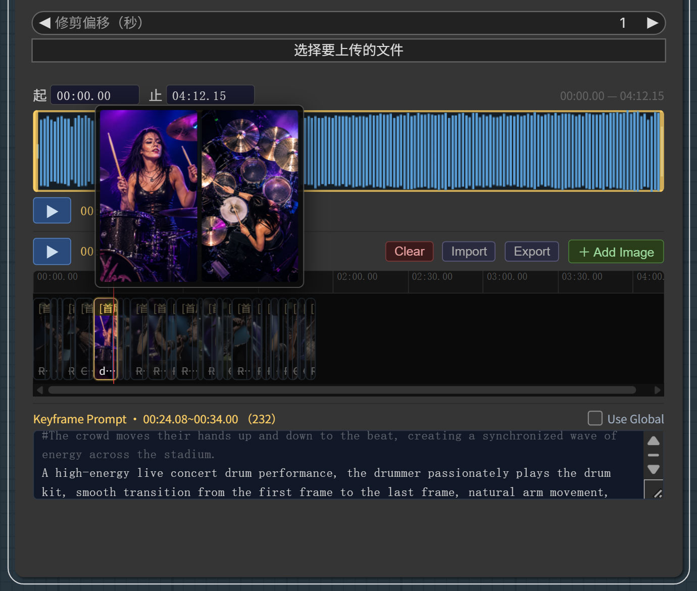

# ComfyUI-Capricorncd-Tools


一套面向 [ComfyUI](https://github.com/comfyanonymous/ComfyUI) 的自定义节点集合，核心是 **Timeline Editor（时间轴编辑器）**——一个全屏、多轨道的可视化编辑器，用于搭建图像/视频/音频序列；此外还包含提示词编辑、音频/图像关键帧时间轴编辑、图像批处理、目录清理与视频合成等工具。



---

## ✨ Timeline Editor（时间轴编辑器）

本项目的核心节点：一个全屏、多轨道的时间轴编辑器，可直接在 ComfyUI 中搭建图像/视频/音频序列。

- **素材库** —— 拖拽导入图片/视频/音频素材，支持星级评分与筛选、批量选择、缺失文件重新关联
- **多轨画布** —— 每条轨道可锁定/显隐/禁音，拖拽/缩放/分割片段，撤销/重做，缩放与平移
- **逐片段提示词** —— 全局与逐片段提示词输入，以及 **AI 优化** 弹窗（可选 Agent 或本地 VL 模型、输出语言、支持从 GitHub 同步的 Prompt Skill 库）
- **生成视频** —— 为片段绑定 ComfyUI `output/` 下的 MP4，支持启用/禁音/预览，再通过 **导出 → 合成视频** 将其与未禁音的音频轨混合为一条 MP4（可选水印、文件名前缀、忽略音频轨道等）
- **导入 / 导出** —— 整个工程与素材可导出为目录或 ZIP
- **界面全面本地化** —— 所有面板、弹窗、菜单均自动跟随 ComfyUI 的 **Settings → Comfy → Locale** 语言设置（English / 简体中文 / 日本語），未覆盖的语言回退到英文；详见下方[国际化](#国际化i18n)

[查看完整文档 →](docs/zh/timeline-editor.md) · [English](docs/timeline-editor.md)

---

## 节点一览

| 节点 | 说明 | 文档 |
|------|------|------|
| **Rich Prompt Input** | 带实时语法高亮、`#` 注释与历史/预设的提示词编辑器 | [→](docs/zh/prompt-input.md) |
| **Prompt Group** | 全局 / 场景 / 负面提示词输入；统计场景提示词有效条数 | [→](docs/zh/prompt-group.md) |
| **Prompt From Batch** | 按索引/长度截取场景提示词；可选合并全局提示词 | [→](docs/zh/prompt-from-batch.md) |
| **Audio Timeline** | 波形修剪 + 图像关键帧时间轴 + 每片段提示词 | [→](docs/zh/audio-timeline.md) |
| **Timeline Editor** | 全屏多轨编辑器；生成视频预览/禁音；导出 → 合成视频；`swap_wh`；输出 `data_json` 与 `frame_seq_dir` | [→](docs/zh/timeline-editor.md) |
| **Data Json Clip Parser** | 从 Audio Timeline / Timeline Editor 的 `data_json` 中提取单个片段 | [→](docs/zh/data-json-clip-parser.md) |
| **MiniMaxH3** | 时间轴 `data_json` 片段 → MiniMax H3 Reference to Video（参考 + 提示词 + latent） | [→](docs/zh/minimax-h3.md) |
| **Save Images** | 将一批图像保存到指定目录；可选写入 `{prefix}.json` 记录提示词与模型 | [→](docs/zh/save-images.md) |
| **Load Images From Dir** | 从目录加载图像为 `IMAGE` 批次 | [→](docs/zh/load-images-from-dir.md) |
| **Image Batch Count** | 返回批次中的图像数量 | [→](docs/zh/image-batch.md) |
| **Image From Batch Index** | 按索引从批次中提取单张图像 | [→](docs/zh/image-batch.md) |
| **Seq To Video** | 通过 ffmpeg 将图像序列和音频合成为 MP4；默认写入同名 JSON 记录提示词与模型 | [→](docs/zh/seq-to-video.md) |
| **Compose Clip Videos** | 将各片段 MP4 合成为一条时间轴视频；可选同名 JSON | [→](docs/zh/compose-clip-videos.md) |
| **Join Strings** | 拼接可变数量的字符串/数值；换行、逗号、`_`、`-`、`/`、空拼接或自定义分隔符 | [→](docs/zh/join-strings.md) |
| **Clear Directory** | 删除目录中选定类型的媒体文件；Windows 支持回收站 | [→](docs/zh/clear-directory.md) |
| **Size Settings** | 尺寸预设 / 倍数 / 锁定比例 / 方向 → `width`、`height`、`count`、`fps` | [→](docs/zh/size-settings.md) |
| **Format JSON** | 在画布上格式化显示 JSON 字符串 | [→](docs/zh/format-json.md) |
| **Show Anything** | 展示任意值；刷新后保留；可选格式化 JSON | [→](docs/zh/show-anything.md) |

---

## 典型工作流

```
Timeline Editor / Audio Timeline
  ├── trimmed_audio / clips_audio ──► （音频处理）
  ├── frame_seq_dir               ──► Save Images（序列帧输出目录）
  ├── data_json                   ──► Data Json Clip Parser（循环逐片段处理）
  │                                     ├── audio、frame_count、first_frame、last_frame、prompt
  │                                     └── ──► 生成节点 ──► Save Images
  │                                               ├── image_paths ──► Seq To Video
  │                                               └── image_dir   ──► Clear Directory（清理）
  │                           或 ──► MiniMaxH3（按 index 循环）──► H3 采样 / 解码
  └── clips_length                ──► 循环上限
```

**禁用 / 启用** 可只重跑某一段而不改动其余时间轴。详见 [Audio Timeline](docs/zh/audio-timeline.md#片段禁用--启用) 与 [Timeline Editor](docs/zh/timeline-editor.md#片段禁用--启用)。

**Timeline Editor** 还可为每个视觉片段绑定 ComfyUI `output/` 下的 **生成视频**（启用 / 禁音 / 预览），并通过 **导出 → 合成视频** 将启用的生成视频与未禁音的音频轨混成一条 MP4，写入 `output/`（默认前缀 `cap_timeline_compose/`）。详见 [Timeline Editor](docs/zh/timeline-editor.md#生成视频)。

---

## 安装

```bash
cd ComfyUI/custom_nodes
git clone https://github.com/capricorncd/ComfyUI-Capricorncd-Tools
```

重启 ComfyUI。除标准 ComfyUI 安装外，无需额外 Python 依赖。

> **Seq To Video**、**Compose Clip Videos** 以及 Timeline Editor 的 **合成视频** 均需安装 [ffmpeg](https://ffmpeg.org/download.html) 并加入系统 `PATH`。

---

## 文档

教程与 UI 说明写在 `docs/zh/`。带 `<!-- AUTO:API -->` 标记的输入/输出表可由节点元数据重新生成：

```bash
python scripts/gen_node_docs.py
```

节点接口字段定义在代码中（`DESCRIPTION`、输入 `tooltip`、`OUTPUT_TOOLTIPS`），便于画布提示与文档保持一致。

---

## 国际化（i18n）

不只是节点图元数据，整个插件都会自动跟随 ComfyUI 的 **Settings → Comfy → Locale** 语言设置，未覆盖的语言回退到英文：

- **节点图元数据**（标题、输入/输出名称、提示语、布尔开关的开/关文案）通过 ComfyUI 内置 i18n 系统本地化，另外为两个使用新版 Schema、ComfyUI 自身语言加载器暂时还覆盖不到的节点做了补丁
- **每个自定义 UI 面板** —— Timeline Editor（素材库、片段设置、AI 优化弹窗、Prompt Skill 选择器、导入导出、合成视频等）、Audio Timeline、Prompt Library（历史记录/预设）—— 所有弹窗、按钮、菜单及状态/错误提示
- **后端返回给前端的错误与状态文案**

语言文件位于 `locales/`：

```
locales/
├── en/nodeDefs.json
├── zh/nodeDefs.json, commands.json
└── ja/nodeDefs.json, commands.json
```

| 语言 | 代码 |
|------|------|
| English | `en` |
| 简体中文 | `zh` |
| 日本語 | `ja` |

切换语言后，新注册的节点定义会立即生效；已打开的面板需要刷新页面后才会应用新语言，与 ComfyUI 自身的本地化行为一致。

---

## 许可证

MIT
