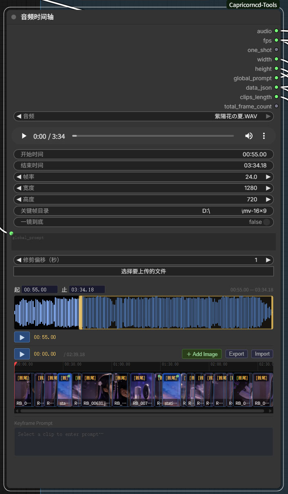
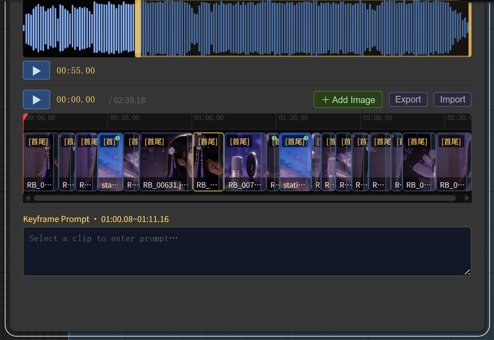

# Audio Timeline

**Category:** `Capricorncd`

A full-featured audio waveform editor with an image keyframe clip track, per-clip prompts, and structured JSON output. Designed for audio-driven video generation pipelines where each segment of the audio corresponds to a generated video clip.





## Panels

### Waveform panel

- Visual waveform powered by [WaveSurfer.js](https://wavesurfer.xyz/)
- Drag the left / right yellow handles to define the trim region (`start_time` / `end_time`)
- Click anywhere on the waveform to move the playhead
- `▶` button plays / pauses the trimmed audio segment
- `←` / `→` arrow keys nudge the active trim handle by one frame

### Clip track

Each clip represents one generation segment: a time range, a start keyframe image, an optional end keyframe image, and a per-clip prompt.

**Adding clips**

| Method | Behaviour |
|--------|-----------|
| `＋ Add Image` button | Opens the OS file browser; the selected image is uploaded and a clip is placed at the current playhead position |
| Double-click the track | Adds a clip at that time position (no image assigned) |

Clips are always contiguous — they pack left automatically after any move, resize, or delete.

**Clip thumbnails and badges**

- Thumbnail shows the start keyframe image if assigned
- `[S]` badge: only a start frame is assigned; click the badge to preview it
- `[S/E]` badge: both start and end frames are assigned; click to preview both

**Right-click context menu**

| Item | Shortcut | Description |
|------|----------|-------------|
| Select Start Image | — | Open image picker to assign a start keyframe |
| Select End Image | — | Open image picker to assign an end keyframe |
| Disable / Enable | `Ctrl+B` | Toggle the clip's disabled state |
| Disable / Enable Others | `Ctrl+G` | Disable all other clips; if all others are already disabled, re-enable them all |
| Copy | — | Copy this clip to the internal clipboard |
| Delete | — | Remove this clip |
| Clear End Image | — | Remove the end keyframe assignment (visible only when an end image is set) |

### Clip disable / enable

The disable feature lets you **re-generate a single segment without touching the rest of the timeline**.

Typical workflow:
1. Run the full generation pass — all clips active.
2. A specific segment needs to be redone.
3. Select that clip → `Ctrl+G` to disable all others (only the target stays enabled).
4. Re-run the generation — only the active clip is processed.
5. `Ctrl+G` again on the same clip to re-enable everything.

Disabled clips:
- Appear faded with a strikethrough label
- Are **excluded** from `data_json` output and from the `total_frame_count` calculation
- Do not affect the enabled clips' timing; `clips_length` only counts active clips

### Prompt area

- When a clip is selected the prompt area switches to **per-clip** mode (label turns gold)
- When no clip is selected the textarea edits the **global prompt**
- Per-clip prompt takes priority; clips with no per-clip prompt fall back to the global prompt

---

## Image picker

The picker panel (opened via right-click → Select Start/End Image) lists all images found in `keyframe_dir`.

- **↻ Refresh** re-scans the directory without closing the picker
- **Browse from disk** uploads an image from anywhere on disk and adds it to the list

---

## Import / Export

| Button | Behaviour |
|--------|-----------|
| **Export** | Saves the full timeline configuration (all widget values + clip list) as `{audio-stem}_{yyyyMMdd_HHmmss}.json` |
| **Import** | Restores widget values and clip list from a previously exported `.json` file |

---

## Keyboard shortcuts

Click anywhere on the waveform or clip track to give the timeline focus. `Ctrl+B` and `Ctrl+G` work whenever a clip is selected regardless of focus.

| Key | Action |
|-----|--------|
| `Space` | Play / pause the timeline |
| `←` / `→` | Move playhead one frame; or nudge the active trim handle |
| `Q` | Trim the left edge of the selected clip to the playhead |
| `W` | Trim the right edge of the selected clip to the playhead |
| `Delete` / `Backspace` | Delete the selected clip |
| `Ctrl+C` | Copy the selected clip |
| `Ctrl+V` | Paste clipboard clip at end of timeline |
| `Ctrl+B` | Disable / Enable the selected clip |
| `Ctrl+G` | Disable / Enable all other clips |
| `Escape` | Deselect / close picker or context menu |

---

## Inputs

| Name | Type | Default | Description |
|------|------|---------|-------------|
| `audio` | FILE | — | Audio or video file from the ComfyUI input directory |
| `fps` | FLOAT | 24.0 | Frames per second |
| `width` | INT | 720 | Output video width (passed through to `data_json`) |
| `height` | INT | 1280 | Output video height (passed through to `data_json`) |
| `keyframe_dir` | STRING | — | Directory containing keyframe images for the picker |
| `one_shot` | BOOLEAN | true | In one-shot mode each non-last clip's end frame is automatically set to the next clip's start frame |
| `global_prompt` | STRING | — | Default prompt for clips that have no per-clip prompt |
| `trim_offset` | INT | 1 | Extra seconds appended to the `AUDIO` output end time for fade/overlap; does **not** affect `data_json` timings or frame counts |

## Outputs

| Name | Type | Description |
|------|------|-------------|
| `trimmed_audio` | AUDIO | Trimmed audio extended by `trim_offset` seconds |
| `fps` | FLOAT | Frames per second |
| `one_shot` | BOOLEAN | One-shot flag |
| `width` | INT | Video width |
| `height` | INT | Video height |
| `global_prompt` | STRING | Global prompt string |
| `data_json` | STRING | Full configuration as JSON (see below); only active (non-disabled) clips are included |
| `clips_length` | INT | Number of active clips |
| `total_frame_count` | INT | Total frame count across all active clips |
| `clips_audio` | AUDIO | Concatenated audio segments from enabled clips only (excludes disabled clips and gaps) |
| `frame_seq_dir` | STRING | Temp directory for frame sequences (`output/temp/capricorncd-frame-sequences`); created on first run, fully cleared on each subsequent run |

---

## `data_json` structure

```json
{
  "audio_path": "/absolute/path/to/audio.mp3",
  "trim_start_ms": 0,
  "trim_end_ms": 30000,
  "total_frame_count": 720,
  "fps": 24.0,
  "width": 720,
  "height": 1280,
  "one_shot": true,
  "global_prompt": "cinematic, 4k",
  "clips": [
    {
      "start_ms": 0,
      "end_ms": 5000,
      "start_image": "/absolute/path/to/frame_001.jpg",
      "end_image": "/absolute/path/to/frame_010.jpg",
      "prompt": "close up portrait",
      "use_global_prompt": false
    }
  ]
}
```

| Clip field | Type | Description |
|------------|------|-------------|
| `start_ms` | number | Clip start time in milliseconds, relative to the trim start |
| `end_ms` | number | Clip end time in milliseconds, relative to the trim start |
| `start_image` | string | Absolute path to the start keyframe image (empty string if not set) |
| `end_image` | string | Absolute path to the end keyframe image; in `one_shot` mode, non-last clips use the next clip's `start_image` |
| `prompt` | string | Per-clip prompt (empty string if not set) |
| `use_global_prompt` | boolean | `true` if the clip uses the global prompt (either explicitly set or because per-clip prompt is empty) |

Disabled clips are **not** written to `clips`. The `total_frame_count` is the sum of active clip durations only.
