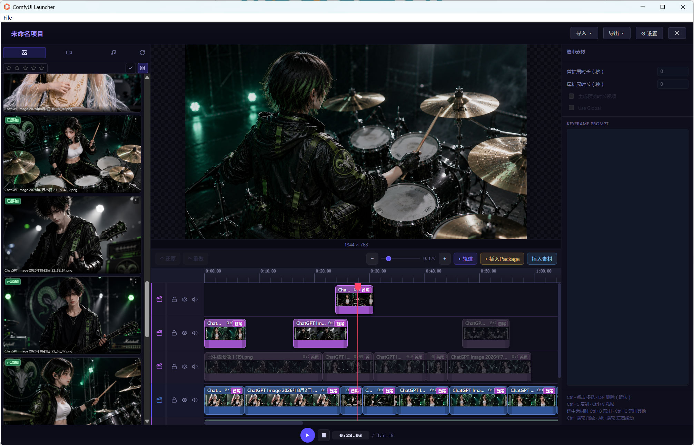

# Timeline Editor

**Category:** `Capricorncd`

Fullscreen multi-track timeline editor for image / video / audio projects. Unlike [Audio Timeline](audio-timeline.md) (single audio + contiguous keyframe clips), Timeline Editor stores a **track-nested `project_json`** and emits a compact runtime `data_json` with per-clip audio slices.

Open the editor from the node launcher (fullscreen shell). Edits sync back into the node's `project_json` widget.



---

## Compared with Audio Timeline

| | Audio Timeline | Timeline Editor |
|--|----------------|-----------------|
| Layout | Waveform + one clip track | Multi-track visual + audio tracks |
| Editable document | Widget values + clip list | Track-nested `project_json` |
| Runtime audio | Trim from one master `audio_path` | Mix overlapping slices into each clip's `audios[]` |

Downstream [Data Json Clip Parser](data-json-clip-parser.md) accepts both formats.

---

## Editor UI

### Media library (left)

- Tabs: **Image** / **Video** / **Audio**
- Lists files uploaded under ComfyUI `input/capricorncd-timeline/`
- Refresh rescans the upload directory
- Drag media onto the timeline, or right-click / insert at the playhead
- Star ratings and star filters for media bookmarks
- Double-click / preview modal for inspection
- Add media via the upload dialog (writes into `input`; no assets directory)

### Preview / Timeline (center)

- **Program monitor** above the timeline: composites the frame under the playhead at the node `width` × `height` aspect ratio (main + overlay layers; image cover; start/end crossfade centered in the clip, ≤1s; video sampled from trim-in); drag the bottom splitter to resize height
- Multiple tracks (visual and audio); add tracks from the toolbar menu
- Per-track: lock, visibility, mute (audio)
- Drag / resize clips; multi-select with `Ctrl+Click`
- Audio-track clips: drag the small corner handles to set linear **fade-in / fade-out** (diagonal overlay); stored as `fade_in_ms` / `fade_out_ms` and applied in playback, `clips_audio` mix, and Compose Video
- Package clips and material insert at the playhead
- **Gen Preview / Asset Preview** toolbar toggle (next to Insert Clip): one-click switch all clips that have generated videos between generated-video preview and asset preview
- Undo / Redo toolbar buttons (editor-local history)
- Zoom: `Ctrl+Wheel`; pan: `Alt+Wheel`

### Inspector (right)

- Selected clip thumbnails (start / end frame where applicable)
- Per-clip **Keyframe Prompt** and **Use Global** checkbox
- **Generated videos** list (when the clip has any): enable checkbox, mute (same icons as track mute), open preview, delete with confirm
- Shortcut reminders

### Project chrome

- Editable project name
- **Import** / **Export**:
  - Directory package or ZIP (all media + `project.json`)
  - **Compose Video**: modal with `filename_prefix` (default `cap_timeline_compose/`), leaf name `projectName_yyyyMMdd_hhmmss.mp4`, and **Ignore audio tracks** (default off). When on, audio-track clips are skipped; unmuted generated-video audio is still mixed. ffmpeg writes under ComfyUI `output/`. Requires **ffmpeg** on `PATH`.
- Header shows `时间轴编辑器 | 项目名称`; click the project name to focus the right-panel name field (clears clip selection). Node width × height and fps are shown on the right (header + project panel).
- Global prompt lives only in the editor (right panel), not as a node widget.
- Close returns to the ComfyUI graph

### Clip context menu (visual)

- Run, AI optimize prompt, disable / disable others, rename, view materials, add generated video
- When the clip is in **generated-video preview** mode: **Mute / Unmute** for the active generated video
- Copy / Paste; **Delete** shown in red

### AI optimize prompt

- Modal: model, output language, Agent prompt, Prompt Skill, result
- Background-audio mode, Generate BGM, and Lyrics controls were removed

---

## Generated videos

Attach ComfyUI `output/` MP4s to a visual clip (context menu **Add generated video**, or after a run).

| Control | Behavior |
|---------|----------|
| Enable | Include in preview / compose selection |
| Mute | During timeline play and Compose Video, skip that file’s audio (default off = play sound) |
| Preview mode badge on clip | Toggle media vs generated preview |
| Delete | Confirm; removes the clip binding only (does not delete the file on disk) |

Compose Video uses each clip’s first **enabled** generated video, placed from the clip’s `start_ms` through `end_ms` (first `duration` seconds of the file).

---

## Clip disable / enable

Same idea as Audio Timeline: re-generate one segment without rebuilding the rest.

| Shortcut | Action |
|----------|--------|
| `Ctrl+B` | Disable / enable the selected clip(s) |
| `Ctrl+G` | Disable all other clips (toggle) |

Disabled / hidden / muted clips are omitted from runtime `data_json`. Tracks that are disabled or invisible are skipped entirely.

---

## Keyboard shortcuts

| Key | Action |
|-----|--------|
| `Ctrl+Click` | Multi-select clips |
| `Delete` / `Backspace` | Delete selection (with confirm) |
| `Ctrl+B` | Disable / enable selected clip |
| `Ctrl+G` | Disable / enable all other clips |
| `Ctrl+Wheel` | Zoom timeline |
| `Alt+Wheel` | Scroll timeline horizontally |

---

## Inputs

| Name | Type | Default | Description |
|------|------|---------|-------------|
| `fps` | FLOAT | 24.0 | Frames per second |
| `width` | INT | 1344 | Output width (written to `data_json`) |
| `height` | INT | 768 | Output height (written to `data_json`) |
| `swap_wh` | BOOLEAN | false | Toggling swaps the current width and height values |
| `project_version` | STRING | package version | Written into project / runtime JSON |
| `project_json` | STRING | empty project | Full editable timeline document (tracks, clips, resources, settings) |
| `trim_offset` | INT | 1 | Reserved for audio tail workflows; runtime clip timings in `data_json` are not extended by this field |

## Outputs

| Name | Type | Description |
|------|------|-------------|
| `fps` | FLOAT | Frames per second |
| `width` | INT | Video width |
| `height` | INT | Video height |
| `global_prompt` | STRING | Effective global prompt from the editor (`project_json.settings.global_prompt`) |
| `data_json` | STRING | Runtime JSON for enabled visible segments only (see below) |
| `clips_length` | INT | Number of runtime clips |
| `total_frame_count` | INT | Sum of runtime clip frame counts at `fps` |
| `clips_audio` | AUDIO | Full-timeline mix of unmuted audio (and video-with-audio) clips |
| `frame_seq_dir` | STRING | Temp directory for frame sequences (`output/temp/capricorncd-frame-sequences`); created on first run, cleared on each subsequent run |

---

## `project_json` (editable)

High-level shape:

```json
{
  "project_version": "x.y.z",
  "schema_version": "x.y.z",
  "name": "Untitled",
  "resources": [],
  "settings": {
    "global_prompt": ""
  },
  "tracks": [
    {
      "id": "track_1",
      "type": "visual",
      "order": 0,
      "enabled": true,
      "visible": true,
      "clips": []
    }
  ]
}
```

The fullscreen editor owns this document; you normally do not edit it by hand.

---

## `data_json` structure (runtime)

```json
{
  "project_version": "x.y.z",
  "schema_version": "x.y.z",
  "fps": 24.0,
  "width": 1344,
  "height": 768,
  "global_prompt": "cinematic",
  "total_frame_count": 120,
  "run_prefix": "20260805_224215",
  "clips": [
    {
      "id": "runtime_0001",
      "source_clip_id": "clip_abc",
      "clip_type": "image",
      "start_ms": 0,
      "end_ms": 5000,
      "start_image": "/absolute/path/to/start.jpg",
      "end_image": "/absolute/path/to/end.jpg",
      "prompt": "close up",
      "use_global_prompt": true,
      "z_index": 1,
      "audios": [
        {
          "source_clip_id": "audio_1",
          "source_kind": "audio",
          "file": "/absolute/path/to/voice.wav",
          "location": "input",
          "source_start_ms": 1000,
          "source_end_ms": 6000,
          "clip_offset_ms": 0
        }
      ]
    }
  ]
}
```

| Field | Description |
|-------|-------------|
| `run_prefix` | Per-execute timestamp string (`YYYYMMDD_HHMMSS`) for a shared filename / folder prefix |
| `start_ms` / `end_ms` | Runtime clip time range (ms) |
| `start_image` / `end_image` | Absolute paths resolved via ComfyUI `input` |
| `audios[]` | Audio/video slices overlapping this visual range; mixed by [Data Json Clip Parser](data-json-clip-parser.md) |
| `z_index` | Track stacking order used when building segments |

There is no top-level `audio_path` (that field is Audio Timeline only).

---

## Typical pipeline

```
Timeline Editor
  ├── data_json      ──► Data Json Clip Parser (looped per clip)
  ├── clips_length   ──► loop limit
  ├── clips_audio    ──► optional audio processing / Seq To Video
  └── frame_seq_dir  ──► Save Images output directory for generated frames
```

See the [root README](../README.md#typical-pipeline) for the full generation → Seq To Video flow.
